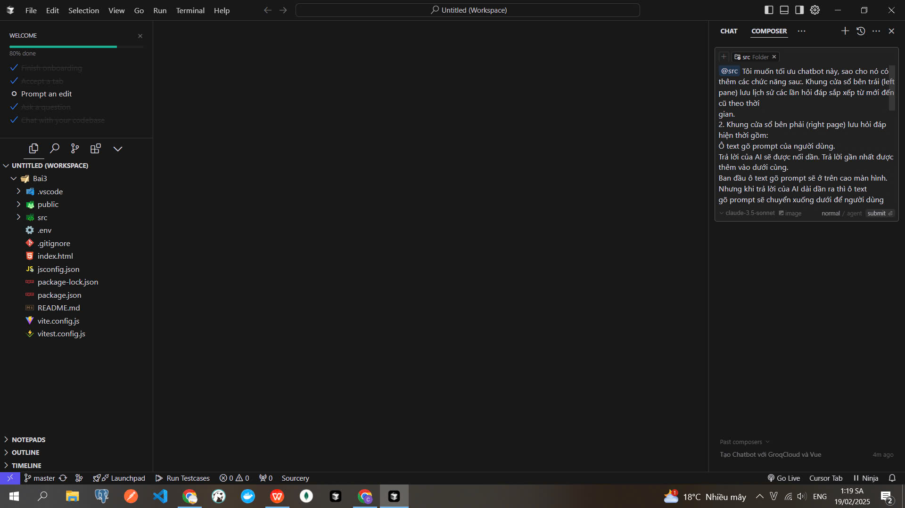

# Groq Cloud Chat Application

Ứng dụng chat với AI sử dụng Groq API, được xây dựng bằng Vue.js.

## Tính năng chính

### 1. Quản lý cuộc trò chuyện

- **Tạo cuộc trò chuyện mới**: Sử dụng nút "NEW CHAT" để tạo cuộc trò chuyện mới
- **Xem lịch sử chat**: Hiển thị danh sách các cuộc trò chuyện ở left pane
- **Xóa cuộc trò chuyện**: Mỗi cuộc trò chuyện có nút xóa (hiện khi hover)
- **Chuyển đổi giữa các cuộc trò chuyện**: Click vào cuộc trò chuyện để xem nội dung

### 2. Tương tác với AI

- **Gửi tin nhắn**: Nhập tin nhắn và nhấn Enter hoặc nút Gửi
- **Hiển thị typing**: Hiệu ứng 3 chấm khi AI đang xử lý
- **Dừng phản hồi**: Nút Stop để dừng AI khi đang trả lời
- **Show Think**: Toggle để xem quá trình suy nghĩ của AI
  - Khi bật: Hiển thị các bước suy nghĩ trước khi đưa ra câu trả lời
  - Khi tắt: Chỉ hiển thị câu trả lời cuối cùng

### 3. Định dạng nội dung

- **Markdown Support**: Hỗ trợ hiển thị nội dung định dạng markdown
- **Code Highlighting**: Tô màu cú pháp cho code blocks
- **Copy Code**: Nút copy cho mỗi code block
- **Responsive Design**: Giao diện thích ứng với kích thước màn hình

## Cấu trúc giao diện

### Header

- Nút NEW CHAT
- Toggle Show Think
- Tiêu đề GROQ CLOUD

### Left Pane (Chat History)

- Danh sách cuộc trò chuyện
- Thời gian tạo
- Tiêu đề (lấy từ câu hỏi đầu tiên)
- Nút xóa cuộc trò chuyện

### Main Chat Area

- Hiển thị tin nhắn qua lại
- Avatar cho user (M) và AI (G)
- Định dạng khác nhau cho tin nhắn user và AI
- Code blocks với syntax highlighting
- Nút copy code

### Input Area

- Ô nhập tin nhắn
- Nút Gửi/Stop

## Xử lý đặc biệt

### Show Think Mode

1. Khi bật Show Think:

   - Gọi API đầu tiên để lấy các bước suy nghĩ
   - Hiển thị từng ký tự một của phần suy nghĩ
   - Gọi API thứ hai để lấy câu trả lời chính
   - Hiển thị câu trả lời

2. Khi tắt Show Think:
   - Chỉ gọi một API để lấy câu trả lời
   - Hiển thị trực tiếp câu trả lời

### Xử lý Stop

- Dừng ngay lập tức việc gọi API
- Giữ nguyên nội dung đã hiển thị
- Hủy bỏ các hiệu ứng typing đang chạy

### Xử lý Code

- Tự động nhận diện ngôn ngữ lập trình
- Tô màu cú pháp theo ngôn ngữ
- Nút copy để sao chép code
- Style riêng cho inline code và code blocks

## Yêu cầu kỹ thuật

- Vue.js 3
- Marked.js cho xử lý markdown
- Highlight.js cho code highlighting
- Font Awesome cho icons
- Groq API cho xử lý AI

## Biến môi trường

VITE_GROQ_API_KEY=your_api_key_here

## Cài đặt và chạy

```bash
# Cài đặt dependencies
npm install

# Chạy development server
npm run dev

# Build cho production
npm run build
```

## Quá trình làm



